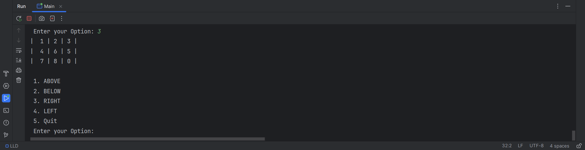

Title: "Puzzle With An Empty Space Game"

This is My First Ever Low Level Design on my own. 
Open contributions and optimization are always Welcome

About:
  This game is about Fixing the numbers in their correct index of the 2D Matrix, 
  At First, We will have a zero which is an metaphor as null space, we can move the element from Above, Below, Left and Right to the zero's position.
  doing this will lead us a way to make those 2D array values in right index, And that's All.
  Only the Last value of the board is gonna be zero, Meanwhile other numbers are fixed at it's right index, Then we WON.

  
